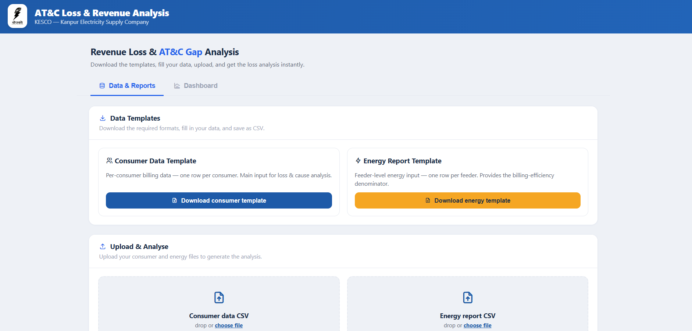
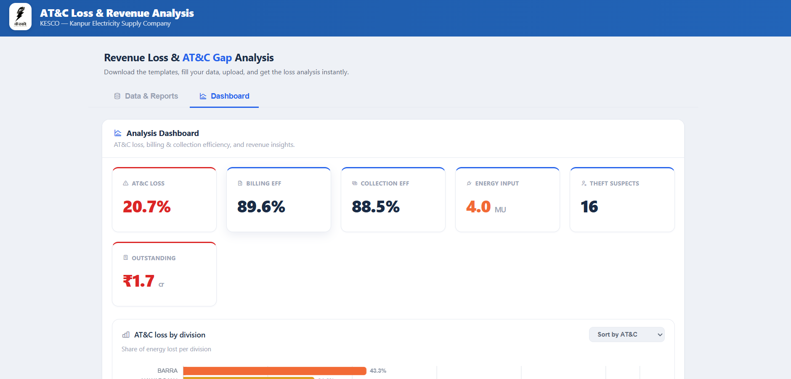

⚡ ATC Loss Analyzer

Automated AT&C (Aggregate Technical & Commercial) loss analysis platform for electricity distribution data, built during a Data Analyst internship with **KESCO (Kanpur Electricity Supply Company Ltd.)**. It turns raw consumer and energy-input exports into structured operational insight — billing efficiency, collection efficiency, AT&C loss, theft suspects, division/feeder breakdowns, and downloadable operations reports — all generated automatically from whatever files a user uploads.

🔗 **Live demo:** [kesco-atc-loss-analyzer.vercel.app](https://kesco-atc-loss-analyzer.vercel.app)
⚙️ **Backend API:** [abhay9984-kesco-atc-api.hf.space](https://abhay9984-kesco-atc-api.hf.space)

> **Note:** the backend runs on Hugging Face's free tier, which sleeps after a period of inactivity. If the demo seems slow on first load, give it 30–60 seconds to wake up — that's the backend restarting, not a bug.

---

## Background

AT&C loss — the combined technical, commercial, and collection losses in a power distribution network — is one of the key performance metrics electricity utilities in India are evaluated on. Calculating it accurately requires joining consumer billing records against feeder-level energy input data, something that's normally done manually in spreadsheets, division by division.

This tool automates that process end to end: upload the two source files, and it handles cleaning, feeder matching, outlier detection, metric calculation, and reporting — reducing what used to take hours of manual spreadsheet work to a single upload.

## What it does

- **Data cleaning & validation** — checks for required columns, strips currency symbols/commas, caps outliers separately for LT and HT consumers (so real large industrial values aren't mistaken for data errors), normalizes load units (kW/BHP/kVA)
- **Feeder matching** — joins consumer billing data to feeder-level energy input using exact feeder codes, with a full match report (which feeders matched, which didn't, why)
- **Core AT&C metrics** — billing efficiency, collection efficiency, and AT&C loss, computed overall and broken down by division and by feeder
- **Loss-cause detection** — flags theft suspects (zero consumption on an active connection), estimated/assessed bills, faulty meters, and missing meters
- **Interactive dashboard** — charts, division/feeder tables, outstanding dues breakdowns (by division, feeder, status, load band), and payment-mode/exception-reason summaries
- **Downloadable reports** — XLSX, PDF, or CSV, in either a summary or fully detailed format

## How it works

1. **Frontend** (`frontend/`) — a static HTML/CSS/JS dashboard where a user uploads two CSVs (consumer master + feeder energy input) and a month label
2. **Backend** (`backend/`) — a Flask API that receives the files, runs them through the analysis pipeline (`backend/pipeline/`), and returns structured JSON
3. The frontend renders that JSON into charts and tables (Chart.js), and can request a formatted report back from the `/download-report` endpoint

```
 -------------          upload CSVs           --------------
|  Frontend   | -----------------------------> |   Backend    |
|  (Vercel)   | <----------------------------- |  (HF Spaces) |
 -------------      analysis JSON /             ------+-------
                     report file                      |
                                                 ------v-------
                                                |   pipeline/   |
                                                | clean -> match|
                                                | -> metrics ->  |
                                                |    report      |
                                                 --------------
```

## Structure

```
backend/            Flask + pandas API (deployed on Hugging Face Spaces)
├── app.py           API routes: /analyze, /download-report, /health
├── Dockerfile
├── requirements.txt
└── pipeline/         analysis pipeline
    ├── clean.py       data cleaning, outlier capping, load normalization
    ├── validate.py     required-column checks
    ├── metrics.py       billing/collection efficiency, AT&C loss
    ├── analyze.py       orchestrates the full analysis, builds the results dict
    └── report.py        XLSX/PDF/CSV report generation

frontend/           Static HTML/CSS/JS dashboard (deployed on Vercel)
├── index.html
├── vercel.json
└── (logo/favicon assets)

demo-data/          Sample consumer + energy CSVs for trying the tool

screenshots/        Upload page and dashboard screenshots (used in this README)
```

## Try it

1. Open the live demo link above
2. Upload the sample files from [`demo-data/`](./demo-data)
3. Explore the dashboard — KPIs, division/feeder tables, outstanding dues, loss causes
4. Download a summary or detailed report (XLSX/PDF/CSV)

## Screenshots

<!-- Add screenshots to a `screenshots/` folder and update the paths below -->

| Upload page | Dashboard |
|---|---|
|  |  |

## Running locally

**Backend:**
```bash
cd backend
pip install -r requirements.txt
python app.py
```
Runs on `http://localhost:5000` by default.

**Frontend:**
Just open `frontend/index.html` in a browser, or serve it with any static server. Update `API_BASE` in `index.html` to point at your local backend if testing locally.

## Tech stack

**Backend:** Flask · pandas · NumPy · openpyxl · ReportLab · gunicorn
**Frontend:** HTML/CSS/JavaScript · Chart.js · PapaParse
**Deployment:** Vercel (frontend) · Hugging Face Spaces, Docker (backend)

## Known limitations

- **No persistence** — each `/analyze` call processes the uploaded files and returns results directly; nothing is saved server-side. Refresh the page and you'll need to re-upload.
- **Synchronous processing** — analysis runs in the same request/response cycle (single gunicorn worker), so very large files will take longer to return rather than processing in the background.
- **Exact feeder-code matching only** — consumer and energy records are joined on an exact feeder code match; feeders with mismatched or missing codes across the two files won't be matched, and will show up in the match report rather than silently dropped.

## Author

Built by **Abhay Agnihotri**

## Note on data

The sample files in `demo-data/` are for demonstration only — no real KESCO consumer or feeder data is included in this repository.
